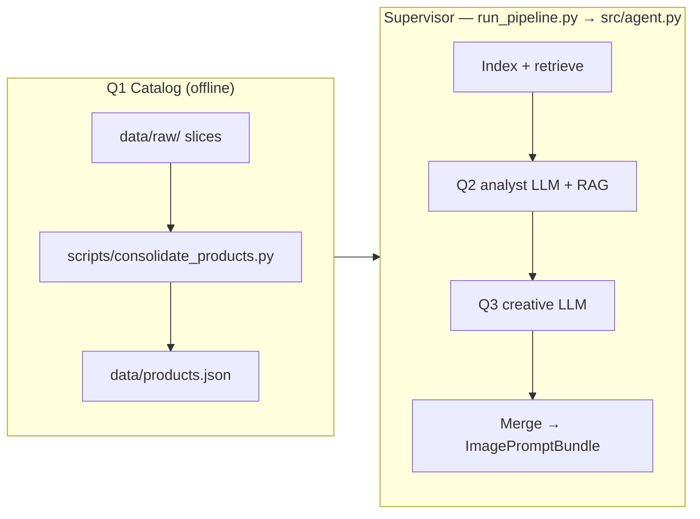

# Generating Product Images from Customer Reviews

**CMU 94-844 · Generative AI Lab (Spring 2026)**

Multistep **AI workflow**: listing + reviews → **Chroma RAG** → **two structured LLM calls** (analyst → creative) → merged **`ImagePromptBundle`** → optional **OpenAI Images** + **Gemini** rendering. Built for reproducible coursework (chunking A/B, dual image backends, documented in the report).

---

## Agentic workflow (how it fits together)

This project uses an **orchestrated multistep pipeline** (fixed sequence, validated handoffs)—not open-ended autonomous agents. That matches a typical **Q4 “agentic workflow”** deliverable: distinct stages, clear artifacts, supervisor logging, and **harnessed** LLM calls with schema validation.



| Stage | Responsibility | Code / artifact |
|-------|----------------|-----------------|
| **Q1** | Choose products, collect listing + reviews (or build from raw JSONL) | `scripts/consolidate_products.py`, **`data/products.json`** · [data layout](data/README.md) |
| **Supervisor** | Order steps, log `q2_analyst` / `q3_creative`, persist bundles | `src/agent.py` |
| **Q2** | RAG-grounded analysis → `ReviewImageryBrief` (shot roles + rationales, no final diffusion prompts) | `src/llm_analysis.py` + `StructuredLLMHarness` (`agent_id`: `q2_analyst`) |
| **Q3** | Full text-to-image **prompts** → `CreativePromptPack` | `src/llm_analysis.py` (`agent_id`: `q3_creative`) |
| **Merge** | Pydantic validation + **exact `shot_index` match** between Q2 and Q3 | `merge_review_brief_with_creative` in `src/models.py` |
| **Images** | Same prompts to two providers (optional) | `src/image_gen.py` |

**Full design, harness practices, and references:** [`docs/agentic_workflow.md`](docs/agentic_workflow.md).

---

## Contents

- [Quick start](#quick-start)
- [Technical pipeline (stages)](#technical-pipeline-stages)
- [Requirements](#requirements)
- [Configuration](#configuration)
- [How to run](#how-to-run)
- [Data layout & hygiene](#data-layout--hygiene)
- [Outputs](#outputs)
- [Repository layout](#repository-layout)
- [Course deliverables](#course-deliverables)
- [Experiments & report](#experiments--report)
- [Troubleshooting](#troubleshooting)
- [License / use](#license--use)

---

## Quick start

```bash
cd /path/to/Project
python3 -m venv .venv
source .venv/bin/activate          # Windows: .venv\Scripts\activate
pip install -r requirements.txt
cp .env.example .env               # add OPENAI_API_KEY; never commit .env
cp data/products.example.json data/products.json   # or use consolidated catalog
python run_pipeline.py --skip-images    # bundles + run_log; no image API cost
# Full run (embeddings + Q2 + Q3 + images):
python run_pipeline.py --images-per-model 3
```

**Catalog:** run `python scripts/consolidate_products.py` to build `data/products.json` + `data/products_manifest.json` from slices in **`data/raw/amazon_reviews_2023/`**.

**Evaluate generated images:**
```bash
python scripts/evaluate_hero_shots.py          # Score all hero shots → outputs/hero_shot_evaluation.json
```

**Generate final PDF report:**
```bash
cd submission
pandoc FINAL_REPORT.md -o final_report.pdf --pdf-engine=pdflatex
```

---

## Technical pipeline (stages)

| Stage | What happens |
|-------|----------------|
| **Chunk & embed** | Listing + reviews → token-aware chunks → embeddings → **Chroma** (`data/chroma/`). |
| **Retrieve** | Multi-query RAG (`src/llm_analysis.py`) deduplicates chunks per product. |
| **Analyze** | **Two** text LLM steps via **`StructuredLLMHarness`** (`src/llm_harness.py`): **Q2** → `ReviewImageryBrief`, **Q3** → `CreativePromptPack`; merge to **`ImagePromptBundle`**. |
| **Render** | Optional: prompts → **OpenAI Images** + optional **Gemini** (`outputs/<ASIN>/openai/`, `.../gemini/`). |

---

## Requirements

- **Python** 3.11+ recommended (3.13 used in development).
- **API keys:** OpenAI (embeddings, text, OpenAI Images); Google AI only if `GEMINI_IMAGE_MODEL` is set.

---

## Configuration

- **Template:** [`.env.example`](.env.example) → copy to `.env`.
- **Syntax:** `KEY=value` (no spaces around `=`).
- **Git:** `.env` is ignored; see [`.gitignore`](.gitignore).

| Variable (common) | Purpose |
|-------------------|---------|
| `OPENAI_API_KEY` | Required for embeddings, text LLM, OpenAI Images. |
| `OPENAI_TEXT_MODEL` | Q2 structured analysis (RAG). |
| `OPENAI_Q3_TEXT_MODEL` | Optional; Q3 creative prompts (defaults to `OPENAI_TEXT_MODEL`). |
| `OPENAI_EMBEDDING_MODEL` | Chroma vectors. |
| `OPENAI_IMAGE_MODEL` | Primary image model. |
| `GEMINI_IMAGE_MODEL` | Optional second provider; needs `GEMINI_API_KEY`. |
| `CHUNK_STRATEGY` | `paragraph_batch` (default) or `sliding` — delete `data/chroma/` after changes. |
| `OPENAI_IMAGE_PROMPT_SUFFIX` / `GEMINI_IMAGE_PROMPT_SUFFIX` | Appended in `src/image_gen.py`. |

Full list: **`.env.example`**.

---

## How to run

| Command | Effect |
|---------|--------|
| `python run_pipeline.py` | Full pipeline: index → RAG + Q2 + Q3 → bundles → images → `run_log.json`. |
| `python run_pipeline.py --skip-images` | No image APIs (chunking / prompt iteration). |
| `python run_pipeline.py --images-per-model 5` | Up to five shots per image model when the bundle defines them. |
| `python run_pipeline.py --data /path/to/products.json` | Alternate catalog. |

After editing **`data/products.json`** or **chunking** env vars, remove **`data/chroma/`** before the next run.

---

## Data layout & hygiene

- **Folder map:** [`data/README.md`](data/README.md) — raw slices vs derived catalog vs Chroma.
- **Submission checklist** (rubric deliverables: data links, code, prompts, images): [`submission/README.md`](submission/README.md).

---

## Outputs

| Path | Description |
|------|-------------|
| `data/chroma/` | Vector index (gitignored; delete to re-embed). |
| `outputs/<ASIN>_image_prompt_bundle.json` | Full bundle + `pipeline_meta` (Q2/Q3 harness telemetry). |
| `outputs/<ASIN>/openai/*.png` | OpenAI Images. |
| `outputs/<ASIN>/gemini/*.png` | Gemini (if configured). |
| `outputs/rejected/` | Rejected images with `rejection_feedback.json` documenting failures and suggested revisions. |
| `outputs/run_log.json` | Steps (`q2_analyst`, `q3_creative`, `image_gen`), `models_used`, `analysis_meta`, image paths. |
| `outputs/hero_shot_evaluation.json` | VLM scores (5 dimensions, 1–5 scale) for all hero shot images. Generated by `scripts/evaluate_hero_shots.py`. |
| `submission/FINAL_REPORT.md` | Final report markdown source (experiments, findings, recommendations). |
| `submission/final_report.pdf` | Final submission PDF (regenerated via pandoc). |

**Git:** `outputs/`, `data/chroma/`, and `docs/` are **gitignored**. For submission, see [`submission/README.md`](submission/README.md).

---

## Repository layout

```
Project/
├── run_pipeline.py
├── requirements.txt
├── .env.example
├── CHANGELOG.md
├── submission/
│   ├── README.md
│   ├── FINAL_REPORT.md
│   └── final_report.pdf
├── data/
│   ├── README.md
│   ├── products.json
│   ├── products.example.json
│   ├── products_manifest.json
│   ├── og-product-images/
│   ├── raw/
│   │   └── amazon_reviews_2023/
│   └── chroma/
├── outputs/
│   ├── run_<timestamp>/
│   ├── rejected/
│   └── *.json
├── docs/
│   ├── agentic_workflow.md
│   └── report_final.md
├── scripts/
│   ├── consolidate_products.py
│   ├── filter_meta_by_rating.py
│   └── evaluate_hero_shots.py
└── src/
    ├── agent.py
    ├── llm_harness.py
    ├── llm_analysis.py
    ├── vlm_qa.py
    ├── rag.py
    ├── chunking.py
    ├── image_gen.py
    ├── models.py
    └── config.py
```

---

## Course deliverables

- Data pointers + **`data/products.json`** (see [`data/README.md`](data/README.md))
- Code (this repo)
- Prompts: `src/llm_analysis.py` + `planned_shots` in `outputs/*_image_prompt_bundle.json`
- Generated images + **`outputs/run_log.json`**
- Final report (e.g. [`docs/report_draft.md`](docs/report_draft.md))
- **Submission zip checklist:** [`submission/README.md`](submission/README.md)

---

## Experiments & report

Experiments and rubric-aligned narrative: **[`docs/report_final.md`](docs/report_final.md)** (detailed analysis, findings, and recommendations).  
**Agentic / Q4 narrative:** **[`docs/agentic_workflow.md`](docs/agentic_workflow.md)**.  
**Final submission:** **[`submission/FINAL_REPORT.md`](submission/FINAL_REPORT.md)** → **`submission/final_report.pdf`** (PDF via pandoc + pdflatex).

### Image Evaluation & Feedback

Generated images are evaluated post-hoc using a VLM (`gpt-5.4-mini`) against a 5-dimension rubric:

- **`scripts/evaluate_hero_shots.py`**: Scores all hero shot images (color palette, silhouette fidelity, photorealism, label/text handling, staging). Output: `outputs/hero_shot_evaluation.json`.
- **Rejected images:** Stored in `outputs/rejected/<product>/` with `rejection_feedback.json` documenting the critical failure, visual critique, and suggested prompt revisions.
- **Self-correction loop:** The VLM critic (`src/vlm_qa.py`) operated during image generation to catch anatomical errors, physical impossibilities, and hallucinated text, triggering re-generation with revised prompts.

---

## Troubleshooting

| Issue | What to try |
|-------|-------------|
| Stale retrieval after editing reviews or chunking | `rm -rf data/chroma`, then re-run. |
| `ImagePromptBundle` validation errors | `python run_pipeline.py --skip-images` after schema changes in `src/models.py`. |
| Image API errors | Check model IDs in `.env` and `src/image_gen.py`. |

---

## License / use

Course project for **CMU 94-844**. **Data provenance:** reviews corpus from [**Amazon Reviews 2023**](https://amazon-reviews-2023.github.io/) (see [`data/README.md`](data/README.md) for citation and layout). Use the dataset per its published terms and your course policy.
