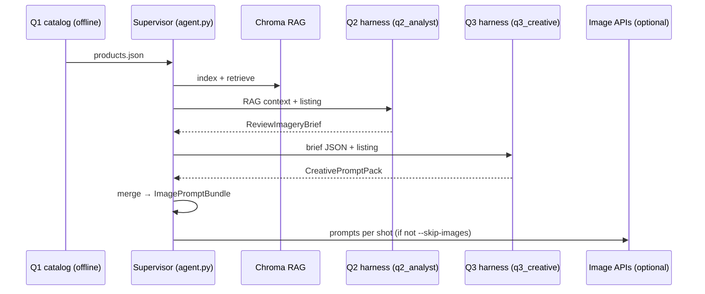

# AI agentic workflow (this project)

This document explains how the **CMU 94-844** pipeline implements an **agentic flow**: separate responsibilities (Q1–Q3), a **supervisor**, **two LLM calls** (analyst vs creative), a **merge step**, and a **per-call harness** around each structured JSON completion. It is meant for the report, onboarding, and reproducibility—not as a second README.

---

## 1. Roles at a glance

| Role | What it is in this repo | Primary artifacts |
|------|-------------------------|-------------------|
| **Q1 — Data / catalog** | Offline preparation: slice Amazon-style data, consolidate products, optional rating filters (`scripts/consolidate_products.py`, `scripts/filter_meta_by_rating.py`) | Raw slices: `data/raw/amazon_reviews_2023/` · derived: `data/products.json`, `data/products_manifest.json` ([`data/README.md`](../data/README.md)) |
| **Supervisor** | Deterministic orchestration: index → retrieve → Q2 → Q3 → merge → save bundle → optional image APIs | `src/agent.py` (`run_pipeline`), `outputs/run_log.json` |
| **Q2 — Analyst / RAG** | Multi-query retrieval over Chroma + one **structured** LLM call producing a **review-grounded brief** without final diffusion prompts | `ReviewImageryBrief` in `src/models.py`; prompts in `src/llm_analysis.py` (`Q2_SYSTEM`, `_build_q2_user`) |
| **Q3 — Creative executive** | Second **structured** LLM call: turns the brief + listing excerpt into **full text-to-image prompts** with image-model constraints | `CreativePromptPack`; prompts (`Q3_SYSTEM`, `_build_q3_user`) |
| **Image backends** | Optional rendering (not “agents”): same `planned_shots[].prompt` → OpenAI Images + optional Gemini | `src/image_gen.py` |

Q1 is **not** an online LLM step; it is still a valid **agent** in the coursework sense if you describe it as the **catalog and data agent** with explicit outputs consumed by the supervisor.

---

## 2. End-to-end sequence

---

## 3. Harness engineering (why `StructuredLLMHarness`)

Industry-oriented material on **agent harnesses** stresses that **reliability comes from the infrastructure around the model**: structured I/O, **verification** after each step, **observability** (what ran, how long, which model), and **avoiding silent failures** when parsing or tools return partial or invalid data. See, for example, discussions of the harness as the operational layer around LLMs ([Harness Engineering — “What is harness engineering?”](https://harness-engineering.ai/blog/what-is-harness-engineering/), [Agent harness architecture](https://harness-engineering.ai/blog/agent-harness-architecture)), and practitioner notes that **orchestration and validation** often dominate failure modes versus raw model knowledge (e.g. [“The agent harness is the architecture”](https://medium.com/@epappas/the-agent-harness-is-the-architecture-and-your-model-is-not-the-bottleneck-5ae5fd067bb2)).

This repo implements a **minimal** subset appropriate for a course project:

| Practice | Where it lives |
|----------|----------------|
| **Structured output** | `response_format={"type": "json_object"}` + **Pydantic** validation per step (`ReviewImageryBrief`, `CreativePromptPack`) |
| **Normalization before validate** | `_normalize_review_brief_json`, `_normalize_creative_pack_json` in `src/llm_analysis.py` (tolerate minor schema drift) |
| **Bounded retries** | `StructuredLLMHarness.complete_json`: up to **2** attempts; **temperature 0** on retry after parse/validation failure |
| **Telemetry** | Each harness returns `agent_id`, `model`, `attempts`, `duration_ms`, token fields when present; merged into `bundle.pipeline_meta` and reflected in supervisor logs |
| **Supervisor verification** | `merge_review_brief_with_creative` **requires identical `shot_index` sets** in Q2 and Q3; mismatch raises **explicitly** (no silent merge) |

What we **did not** add (optional future work): distributed tracing (OpenTelemetry), automatic eval suites, or a large tool registry—those are valuable in production but out of scope here.

---

## 4. Data artifacts between steps

1. **Q1 → Supervisor:** `Product` entries (ASIN, title, description, reviews, etc.).
2. **RAG → Q2:** Deduplicated chunk list; serialized as numbered excerpts in the Q2 user prompt (`build_rag_context`).
3. **Q2 → Q3:** `ReviewImageryBrief` (all analytical fields + `planned_shots` as `PlannedShotBrief`: `shot_index`, `role`, `rationale_from_reviews` **only**).
4. **Q3 → Supervisor:** `CreativePromptPack`: `{ "planned_shots": [ { "shot_index", "prompt" }, ... ] }`.
5. **Supervisor → disk / image step:** `ImagePromptBundle` = merge of Q2 + Q3; same JSON shape as before for **`outputs/<ASIN>_image_prompt_bundle.json`**.

`pipeline_meta` on the bundle includes RAG query list, chunk count, chunking settings, and **`q2_harness` / `q3_harness`** telemetry dicts.

---

## 5. Configuration

| Variable | Purpose |
|----------|---------|
| `OPENAI_TEXT_MODEL` | Q2 analyst model |
| `OPENAI_Q3_TEXT_MODEL` | Q3 creative model (optional; defaults to `OPENAI_TEXT_MODEL`) |
| `CHUNK_STRATEGY`, `CHUNK_MAX_TOKENS`, … | RAG chunking (affects Q2 context) |

Image models remain `OPENAI_IMAGE_MODEL`, `GEMINI_IMAGE_MODEL`, etc. (`src/config.py`).

---

## 6. How to explain this in a report (short)

- **Multi-agent:** Q1 (data), Q2 (analyst), Q3 (creative), plus a **supervisor** that orders steps and validates merge preconditions.
- **Agentic:** More than one **reasoning** call with **handoffs** via typed JSON—not a single monolithic prompt.
- **Harness:** Each LLM call uses the same **StructuredLLMHarness** pattern: JSON → validate → telemetry; retries are bounded and failures are loud.

---

## 7. Related files

| File | Role |
|------|------|
| `src/llm_harness.py` | Generic structured JSON completion + telemetry + retries |
| `src/llm_analysis.py` | RAG assembly, Q2/Q3 prompts, `analyze_product_with_rag` |
| `src/models.py` | `ReviewImageryBrief`, `CreativePromptPack`, `merge_review_brief_with_creative`, `ImagePromptBundle` |
| `src/agent.py` | Supervisor; logs `q2_analyst` and `q3_creative` after analysis |
| `run_pipeline.py` | CLI entry |

---

## 8. References (external)

- Harness Engineering — [What is harness engineering?](https://harness-engineering.ai/blog/what-is-harness-engineering/), [Agent harness architecture](https://harness-engineering.ai/blog/agent-harness-architecture/), [Agent evaluation & observability](https://harness-engineering.ai/blog/agent-evaluation-observability-in-production-ai/)
- Evangelos Pappas (2026) — [The agent harness is the architecture](https://medium.com/@epappas/the-agent-harness-is-the-architecture-and-your-model-is-not-the-bottleneck-5ae5fd067bb2)

These informed the **design vocabulary** (harness, verification, traces); the code is a **deliberately small** implementation of those ideas.
